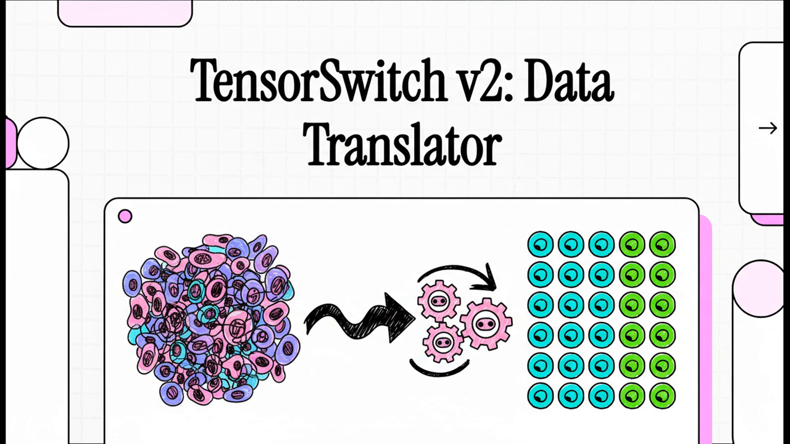

# TensorSwitch v2

**Version**: 2.0.3
**Status**: Production Ready
**Branch**: `main`

A high-performance microscopy data conversion tool with TensorStore as the unified intermediate format. Supports 200+ input formats, automatic multi-scale pyramid generation, and distributed processing on LSF clusters.

> **Active development** happens on the [`unified` branch](https://github.com/JaneliaSciComp/tensorswitch/tree/unified). The `main` branch receives periodic merges from `unified`.

> **Looking for v1?** The original task-based TensorSwitch (v1) is on the [`v1` branch](https://github.com/JaneliaSciComp/tensorswitch/tree/v1). Use `git checkout v1` to access it.

---

## Table of Contents

1. [Features](#features)
2. [Architecture](#architecture)
3. [Installation](#installation)
4. [Quick Start](#quick-start)
5. [CLI Reference](#cli-reference)
6. [Python API](#python-api)
7. [Supported Formats](#supported-formats)
8. [Multi-Scale Pyramids](#multi-scale-pyramids)
9. [Batch Processing](#batch-processing)
10. [LSF Cluster Submission](#lsf-cluster-submission)
11. [Auto-Calculation](#auto-calculation)
12. [Examples](#examples)
13. [MCP Server](#mcp-server-aiagent-integration)
14. [Module Structure](#module-structure)
15. [Citation](#citation)

---

<p align="center">
  <a href="https://drive.google.com/file/d/1HWX7P-EZfj_NOKsv0YdbXXnlL8DXirSW/view?usp=sharing">
    
  </a>
  <br>
  <em>Click the image to watch the Data Translator demo video on Google Drive</em>
</p>

---

## Features

- **Universal Format Support**: Read 200+ microscopy formats via three-tier reader strategy
- **TensorStore Backend**: High-performance intermediate format for efficient chunk processing
- **Auto-Detection**: Automatic format detection and optimal reader selection
- **Multi-Scale Pyramids**: Automatic pyramid generation with chained downsampling
- **Batch Processing**: Convert thousands of files with LSF job arrays
- **LSF Cluster Support**: Auto-calculated resources (memory, wall time, cores)
- **Preserve Source Layout**: Maintains source dimensionality (3D/4D/5D) and axis order per OME-NGFF RFC-3
- **Compression**: zstd compression with configurable levels
- **Frame-Based Optimization**: Auto-capped chunk defaults for large ND2/TIFF/IMS/CZI files with frame-level read cache (63x speedup)
- **Remote Sources**: Read from GCS, S3, HTTP URLs with optional bounding box subvolume extraction
- **Software Attribution**: All output metadata includes `_software` field with TensorSwitch version and GitHub link
- **OME XML Export**: Writes `OME/METADATA.ome.xml` (or `.czi.xml`) as standalone file for easy access and tool compatibility
- **Isotropic Upsampling**: Upsample anisotropic data to isotropic resolution via `scipy.ndimage.zoom` (trilinear for images, nearest-neighbor for labels), with automatic pyramid generation
- **Dtype Casting**: Convert output to a different numeric dtype (e.g., float32 → int16) with upfront range validation and per-chunk clipping safety
- **Safe Write**: Writes to `.tmp` during conversion and renames on completion — interrupted jobs never leave corrupted output
- **Chunk Write Retry**: Automatic retry with exponential backoff (3 attempts) for transient I/O errors on network storage — failed chunks are tracked and the job fails with a summary of failed indices
- **Add to Existing Container**: `--add-to-existing` safely adds labels to a container that already has image data (subgroup-level safe write to `labels.tmp/`) — no risk of overwriting existing `raw/` data. Supported in CLI, MCP, and LSF `--submit`.
- **MCP Server**: AI/agent integration via Model Context Protocol (Claude Code, LLM agents)

---

## Architecture

```
┌─────────────────────────────────────────────────────────────────┐
│                         User Interface                          │
│                    CLI (python -m tensorswitch_v2)              │
└─────────────────────────────────────────────────────────────────┘
                                 │
                                 ▼
┌─────────────────────────────────────────────────────────────────┐
│                      Core Processing Layer                       │
│  DistributedConverter │ PyramidPlanner │ BatchConverter         │
└─────────────────────────────────────────────────────────────────┘
                                 │
              ┌──────────────────┼──────────────────┐
              ▼                  ▼                  ▼
┌─────────────────────┐  ┌─────────────┐  ┌─────────────────────┐
│      Readers        │  │ TensorStore │  │      Writers        │
│  (120+ formats)     │◀─│   Array     │─▶│  (3 formats)        │
│  Tier 1/2/3/4       │  │ (Unified)   │  │  Zarr3/Zarr2/N5     │
└─────────────────────┘  └─────────────┘  └─────────────────────┘
```

### Three-Tier Reader Strategy

| Tier | Performance | Formats | Description |
|------|-------------|---------|-------------|
| **Tier 1** | Maximum | N5, Zarr2, Zarr3, Precomputed | Native TensorStore drivers |
| **Tier 2** | Optimized | TIFF, ND2, IMS, HDF5, CZI | Custom optimized readers |
| **Tier 3** | Compatible | LIF + 20 more | BIOIO Python plugins |
| **Tier 4** | Universal | 150+ formats | Bio-Formats Java (via bioio-bioformats) |

---

## Installation

### Prerequisites

- **Python 3.11+** (required)
- **Java 8+** (only if using Bio-Formats for 150+ format support)
- **Git** (only if installing from GitHub)

### Option 1: Pip Install

Works on **Linux**, **macOS**, and **Windows**.

```bash
# Core install (Tier 1 + Tier 2 + Tier 3 readers, CLI, all writers)
pip install tensorswitch

# With Bio-Formats support (Tier 4, 150+ formats, requires Java 8+)
pip install "tensorswitch[bioformats]"

# With MCP server for Claude Code / LLM agents
pip install "tensorswitch[mcp]"

# Everything
pip install "tensorswitch[all]"
```

**Install from GitHub** (latest development version):

```bash
pip install git+https://github.com/JaneliaSciComp/tensorswitch.git
```

**Install from local checkout** (for development):

```bash
git clone https://github.com/JaneliaSciComp/tensorswitch.git
cd tensorswitch
pip install -e .                  # Core only
pip install -e ".[bioformats]"    # Core + Bio-Formats
pip install -e ".[all]"           # Everything
```

### Option 2: Pixi Environment (Recommended for Janelia)

[Pixi](https://pixi.sh) manages both Python and non-Python dependencies (Java, conda packages) in a single reproducible environment.

```bash
# Install pixi if you don't have it (Linux/macOS)
curl -fsSL https://pixi.sh/install.sh | bash

# Clone and install
git clone https://github.com/JaneliaSciComp/tensorswitch.git
cd tensorswitch
pixi install
```

### Verify Installation

```bash
# After pip install
tensorswitch-v2 --version

# Using pixi
pixi run tensorswitch-v2 --version
# Output: tensorswitch_v2 2.0.3
```

### Python API

```python
from tensorswitch_v2 import __version__, TensorSwitchDataset, Readers, Writers
print(__version__)  # 2.0.3
```

### What's Included

| Install Command | Formats Supported | Dependencies |
|---|---|---|
| `pip install tensorswitch` | N5, Zarr, TIFF, ND2, IMS, HDF5, CZI, LIF, Precomputed + 20 more | tensorstore, numpy, tifffile, h5py, nd2, dask, bioio |
| `pip install "tensorswitch[bioformats]"` | + 150 more via Bio-Formats | + bioio-bioformats, scyjava (requires Java 8+) |
| `pip install "tensorswitch[mcp]"` | + MCP server for AI agents | + mcp |
| `pip install "tensorswitch[all]"` | Everything above | All of the above |

---

## Quick Start

> **Note**: Examples below show `pixi run` prefix for Janelia cluster. If you installed via pip, omit `pixi run`.

### Single File Conversion

```bash
# Convert TIFF to Zarr3 (auto-detect format)
pixi run tensorswitch-v2 -i input.tif -o output.zarr

# Convert ND2 to Zarr3 with custom chunk shape
pixi run tensorswitch-v2 -i input.nd2 -o output.zarr --chunk_shape 32,256,256

# Convert to Zarr2 format
pixi run tensorswitch-v2 -i input.tif -o output.zarr --output_format zarr2
```

### Generate Multi-Scale Pyramid

```bash
# Convert + generate full pyramid in one command
pixi run python -m tensorswitch_v2 -i input.tif -o output.zarr --auto_multiscale

# Or generate pyramid on an existing dataset
pixi run python -m tensorswitch_v2 -i output.zarr --auto_multiscale
```

### Submit to LSF Cluster

```bash
# Submit conversion job to cluster
pixi run python -m tensorswitch_v2 -i input.tif -o output.zarr \
  --submit -P scicompsoft
```

---

## CLI Reference

### Basic Arguments

| Argument | Description | Default |
|----------|-------------|---------|
| `-i, --input` | Input file or directory | Required |
| `-o, --output` | Output path | Required |
| `--output_format` | Output format: `zarr3`, `zarr2`, `n5` | `zarr3` |
| `-V, --version` | Show version | - |
| `--quiet` | Suppress progress output | False |
| `--show_spec` | Preview conversion specs without running | False |
| `--no-omero` | Disable omero channel metadata generation | False |

### Presets

| Argument | Description |
|----------|-------------|
| `--preset webknossos` | WebKnossos-optimized settings: zarr3, chunk 32x32x32, shard 1024x1024x1024, zstd |
| `--preset paintera` | Paintera-ready settings: n5, xyz axis order, gzip, chunk 64x64x64. Use with `--output_format zarr2` for zyx Zarr2 output. Output is consumed by [paintera-conversion-helper](https://github.com/saalfeldlab/paintera-conversion-helper) to produce Paintera-native format. |
| `--preset mia_lmvd` | MIA Large Microscopy Volume Dataset settings: zarr3, chunk 128x128x128, shard 512x512x512, zstd-5, C-order. Axis order preserved from source (RFC-3: t,c,z,y,x or z,y,x for 3D). Dtype and voxel size preserved from source unless explicitly overridden with `--dtype` or `--voxel_size`. |

```bash
# Example: Convert for WebKnossos viewing
pixi run python -m tensorswitch_v2 -i input.tif -o output.zarr --preset webknossos

# Example: Convert TIFF for Paintera (N5 output, xyz axis order)
pixi run python -m tensorswitch_v2 -i input.tif -o output.n5 --preset paintera

# Example: Convert Zarr3 for Paintera (Zarr2 output, zyx axis order)
pixi run python -m tensorswitch_v2 -i input.zarr -o output.zarr --preset paintera --output_format zarr2

# Example: Convert for MIA LMVD (Janelia internal)
pixi run python -m tensorswitch_v2 -i input.zarr -o output.zarr --preset mia_lmvd
```

### Chunk/Shard Configuration

| Argument | Description | Default |
|----------|-------------|---------|
| `--chunk_shape` | Inner chunk shape (e.g., `32,256,256`) | Auto |
| `--shard_shape` | Shard shape for Zarr3 (e.g., `64,512,512`) | Auto |
| `--no_sharding` | Disable sharding (Zarr3 only) | False |
| `--compression` | Compression codec | `zstd` |
| `--compression_level` | Compression level (1-22) | `5` |
| `--dtype` | Output dtype override (e.g., `uint8`, `int16`, `uint16`, `float32`) | Source dtype |

### Dtype Casting

Cast the output to a different numeric dtype during conversion. Useful for reducing memory footprint (e.g., float32 → int16 for Neuroglancer viewing).

```bash
# Convert float32 zarr2 to int16 zarr3 with sharding
pixi run python -m tensorswitch_v2 -i input.zarr -o output.zarr --dtype int16

# Submit to cluster with dtype cast + pyramid
pixi run python -m tensorswitch_v2 -i input.zarr -o output.zarr \
  --dtype int16 --auto_multiscale --submit -P scicompsoft
```

**Safety**: Before conversion starts, the converter samples the source data and raises an error if values would be clipped by the target dtype range. For float → integer casts, values are clipped to the target range per chunk as a secondary safety net.

### Upsampling (Anisotropic → Isotropic)

| Argument | Description | Default |
|----------|-------------|---------|
| `--upsample` | Upsample mode: resample anisotropic data to isotropic resolution | False |
| `--target_voxel_size` | Target isotropic voxel size in nm | Auto (smallest source voxel) |
| `--upsample_method` | Interpolation method: `auto`, `trilinear`, `nearest`, `cubic` | `auto` |

Combine with `--auto_multiscale` to generate an isotropic pyramid after upsampling. Combine with `--submit` for LSF cluster submission.

```bash
# Upsample anisotropic data (9x9x20 nm) to isotropic (9x9x9 nm) + pyramid
pixi run python -m tensorswitch_v2 --upsample --auto_multiscale \
  -i /data/anisotropic.zarr/img/s0 \
  -o /data/isotropic.zarr \
  --submit -P scicompsoft

# Upsample labels with nearest-neighbor interpolation
pixi run python -m tensorswitch_v2 --upsample --auto_multiscale \
  -i /data/anisotropic.zarr/labels/seg/s0 \
  -o /data/isotropic_labels.zarr \
  --upsample_method nearest \
  --submit -P scicompsoft
```

**How it works**: Processes in XY-column chunks (full Z per column), applies `scipy.ndimage.zoom(grid_mode=True)` for interpolation, writes via TensorStore. Supports zarr2 and zarr3 (with/without sharding) output formats.

### Downsampling

| Argument | Description |
|----------|-------------|
| `--auto_multiscale` | Generate full pyramid from s0 |
| `--downsample` | Single-level downsampling mode |
| `--target_level` | Target level for single-level mode |
| `--single_level_factor` | Factor for single-level mode (e.g., `1,4,4` for s2) |
| `--per_level_factors` | Custom per-level factors for pyramid (e.g., `1,2,2;1,2,2;1,2,2`) |
| `--downsample_method` | Downsampling method: `auto` (default), `mean`, `mode`, `median`, `stride`, `min`, `max` |

### LSF Cluster

| Argument | Description | Default |
|----------|-------------|---------|
| `--submit` | Submit as LSF job | False |
| `-P, --project` | LSF project name | Required with `--submit` |
| `--memory` | Memory in GB | Auto-calculated |
| `--wall_time` | Wall time (H:MM) | Auto-calculated |
| `--cores` | Number of cores | Auto-calculated |
| `--job_group` | LSF job group | `/scicompsoft/chend/tensorstore` |
| `--log_dir` | Directory for LSF log files | `{output_parent}/output/` |

### Batch Processing

| Argument | Description | Default |
|----------|-------------|---------|
| `--pattern` | File pattern for batch mode | `*.tif` |
| `--recursive` | Search subdirectories | False |
| `--max_concurrent` | Max concurrent LSF jobs | `100` |
| `--skip_existing` | Skip completed files | True |
| `--status` | Check batch status | - |
| `--dry_run` | Preview without executing | False |

### Format-Specific

| Argument | Description |
|----------|-------------|
| `--view_index` | CZI view index (None = all views as 5D) |
| `--use_bioio` | Force BIOIO adapter (Tier 3, Python plugins) |
| `--use_bioformats` | Force Bio-Formats reader (Tier 4, Java-backed, 150+ formats) |
| `--dataset_path` | Path within container (e.g., `s0` for N5) |

### Layout Preservation

| Argument | Description |
|----------|-------------|
| `--axes_order` | Override output spatial axis order (e.g., `xyz`, `zyx`, `xzy`). Default: preserve source order. |
| `--expand-to-5d` | Force 5D TCZYX expansion (legacy behavior) |

**Default behavior (RFC-3 compliant)**: Source dimensionality and axis order are preserved:
- 3D XYZ → 3D XYZ (not expanded to 5D)
- 4D CZYX → 4D CZYX
- Axis order preserved (XYZ stays XYZ, ZYX stays ZYX)

**Axis reorder**: Use `--axes_order` when the output tool expects a specific spatial axis order different from the source. Accepts any permutation of x, y, z. Data is transposed during conversion; voxel sizes (indexed by axis name) are unaffected.

```bash
# ND2 source is ZYX, transpose to XYZ for WebKnossos
pixi run python -m tensorswitch_v2 -i input.nd2 -o output.zarr \
  --preset webknossos --axes_order xyz --voxel_size 160,160,400
```

**Singleton channel squeeze**: When reading neuroglancer precomputed format with `num_channels=1`, the implicit 4th channel dimension is automatically squeezed out to preserve true 3D output.

Use `--expand-to-5d` for compatibility with tools requiring strict 5D TCZYX format.

### Memory Order

| Argument | Description |
|----------|-------------|
| `--force_c_order` | Force C-order (row-major) output |
| `--force_f_order` | Force F-order (column-major) output |

**Default behavior**: Source order is auto-detected and preserved. Use these flags only to override.

### Remote Sources & Subvolume Extraction

| Argument | Description |
|----------|-------------|
| `--bbox` | Bounding box for subvolume extraction: `origin_0,origin_1,origin_2,size_0,size_1,size_2`. Values are voxel indices in source dimension order. |

**Remote URL support**: Tier 1 readers (Neuroglancer precomputed, Zarr2/3, N5) accept remote URLs as input — GCS (`gs://`), S3 (`s3://`), and HTTP/HTTPS. Prefix with `precomputed://` for Neuroglancer precomputed format.

```bash
# Extract a subvolume from a remote dataset (MICRONS on GCS)
pixi run python -m tensorswitch_v2 \
  -i "precomputed://gs://iarpa_microns/minnie/minnie65/em" \
  -o /output/microns-crop.zarr --output_format zarr2 \
  --bbox 116316,87591,21337,10240,10240,1024 \
  --voxel_size 8,8,40

# Remote read without bbox (full volume — use with caution on large datasets)
pixi run python -m tensorswitch_v2 \
  -i "precomputed://https://storage.googleapis.com/iarpa_microns/minnie/minnie65/em" \
  -o /output/microns.zarr --output_format zarr2 \
  --voxel_size 8,8,40
```

**Bbox coordinates** are always in voxel indices (integers), in the source's dimension order:
- For Neuroglancer precomputed: X, Y, Z order
- For Zarr/N5: Z, Y, X order (or whatever the source axes are)

### Metadata Override

| Argument | Description |
|----------|-------------|
| `--voxel_size` | Override voxel size, comma-separated X,Y,Z (e.g., `160,160,400`). Values are in nanometers by default, or in the unit specified by `--voxel_unit`. |
| `--voxel_unit` | Override spatial unit in OME metadata: `nanometer`, `micrometer`, `millimeter`. When set, voxel sizes are written as-is in this unit. |
| `--no-translation` | Disable translation transforms in OME-NGFF multiscale metadata. Default: translation ON (for Neuroglancer alignment). |
| `--no_ome_meta_export` | Disable writing `OME/METADATA.ome.xml` (or `.czi.xml`) file. Default: ON when source has XML metadata. |
| `--no_ome_xml_attr` | Do not embed OME/CZI XML in zarr.json/.zattrs. Keeps standalone XML file. Reduces metadata size for faster loading. |

**Use case**: When source files lack embedded voxel size metadata (e.g., raw TIFF stacks, flat Zarr arrays). If a source file has no voxel metadata and `--voxel_size` is not provided, the converter will error rather than silently guessing.

```bash
# Set voxel size in nanometers (default unit)
pixi run python -m tensorswitch_v2 -i input.tif -o output.zarr \
  --voxel_size 160,160,400

# Set voxel size in micrometers
pixi run python -m tensorswitch_v2 -i input.tif -o output.zarr \
  --voxel_size 0.108,0.108,0.268 --voxel_unit micrometer

# Disable translation transforms (e.g., for tools that don't use them)
pixi run python -m tensorswitch_v2 --auto_multiscale \
  -i output.zarr/s0 -o output.zarr --no-translation --submit -P scicompsoft
```

### Unit Handling

TensorSwitch v2 follows these rules for spatial units:

| Operation | Unit Behavior |
|-----------|---------------|
| **New conversions** (TIFF/ND2/CZI → Zarr) | Converts to **nanometers** by default. Use `--voxel_unit` to write in a different unit. |
| **Downsampling/Pyramid** (existing Zarr → pyramid levels) | **Preserves source s0 unit** (micrometer, nanometer, etc.) for consistency. |
| **`--voxel_unit` override** | Values from `--voxel_size` are written as-is in the specified unit (no conversion). |

**Examples:**
- TIFF with 0.116 µm voxels → Zarr with `"unit": "nanometer"` and scale `[116.0, 116.0, 400.0]`
- `--voxel_size 0.108,0.108,0.268 --voxel_unit micrometer` → Zarr with `"unit": "micrometer"` and scale `[0.268, 0.108, 0.108]`
- BigStitcher Zarr2 with `"unit": "micrometer"` → Pyramid levels keep `"unit": "micrometer"`

---

## Python API

### TensorSwitchDataset

```python
from tensorswitch_v2.api import TensorSwitchDataset, Readers, Writers

# Auto-detect format and create dataset
dataset = TensorSwitchDataset("/path/to/data.tif")

# Access properties
print(dataset.shape)      # (100, 2048, 2048)
print(dataset.dtype)      # uint16
print(dataset.ndim)       # 3

# Get TensorStore array
ts_array = dataset.get_tensorstore_array(mode='open')

# Get OME-NGFF metadata
metadata = dataset.get_ome_ngff_metadata()
voxel_sizes = dataset.get_voxel_sizes()  # {'x': nm, 'y': nm, 'z': nm} in nanometers
```

### Readers Factory

```python
from tensorswitch_v2.api import Readers

# Auto-detect (recommended)
reader = Readers.auto_detect("/path/to/data.tif")

# Explicit reader selection
reader = Readers.tiff("/path/to/data.tif")      # Tier 2
reader = Readers.nd2("/path/to/data.nd2")       # Tier 2
reader = Readers.czi("/path/to/data.czi")       # Tier 2
reader = Readers.ims("/path/to/data.ims")       # Tier 2
reader = Readers.n5("/path/to/data.n5")         # Tier 1
reader = Readers.zarr3("/path/to/data.zarr")    # Tier 1
reader = Readers.bioio("/path/to/data.lif")     # Tier 3
reader = Readers.bioformats("/path/to/data.vsi")  # Tier 4 (Java)

# Get TensorStore array (unified API — all tiers return ts.TensorStore)
store = reader.get_tensorstore()
metadata = reader.get_metadata()
```

### Writers Factory

```python
from tensorswitch_v2.api import Writers

# Create writers
writer = Writers.zarr3("/path/to/output.zarr",
                       use_sharding=True,
                       compression="zstd",
                       compression_level=5)

writer = Writers.zarr2("/path/to/output.zarr",
                       compression="blosc")

writer = Writers.n5("/path/to/output.n5")
```

### DistributedConverter

```python
from tensorswitch_v2.api import Readers, Writers
from tensorswitch_v2.core import DistributedConverter

# Create reader and writer
reader = Readers.auto_detect("/path/to/input.tif")
writer = Writers.zarr3("/path/to/output.zarr")

# Create converter
converter = DistributedConverter(reader, writer)

# Full conversion (chunk/shard shapes are optional - auto-calculated if omitted)
converter.convert(
    chunk_shape=(32, 256, 256),   # Optional: example value
    shard_shape=(64, 512, 512),   # Optional: example value
    write_metadata=True,
    verbose=True
)

# Or let it auto-calculate optimal shapes (recommended)
converter.convert(write_metadata=True, verbose=True)

# Partial conversion (for LSF multi-job mode)
converter.convert(
    start_idx=0,
    stop_idx=100,
    write_metadata=False  # Last job writes metadata
)
```

### PyramidPlanner

```python
from tensorswitch_v2.core import PyramidPlanner, create_pyramid_parallel

# Plan pyramid levels
planner = PyramidPlanner("/path/to/dataset.zarr/s0")
plan = planner.calculate_pyramid_plan()

# Print plan
planner.print_pyramid_plan(plan)

# Submit chained pyramid jobs to LSF
planner.submit_chained_pyramid(
    pyramid_plan=plan,
    project="scicompsoft",
    output_format="zarr3"
)

# Or use convenience function
create_pyramid_parallel(
    s0_path="/path/to/dataset.zarr/s0",
    root_path="/path/to/dataset.zarr",
    project="scicompsoft"
)
```

### BatchConverter

```python
from tensorswitch_v2.core import BatchConverter

# Create batch converter
batch = BatchConverter(
    input_dir="/path/to/tiffs/",
    output_dir="/path/to/output/",
    pattern="*.tif",
    output_format="zarr3",
    recursive=False
)

# Discover files
files = batch.discover()
print(f"Found {len(files)} files")

# Submit to LSF
batch.submit_lsf(
    project="scicompsoft",
    memory_gb=30,
    wall_time="1:00",
    max_concurrent=100
)

# Check status
result = batch.check_status()
print(f"Completed: {result.completed}/{result.total}")
```

---

## Supported Formats

### Input Formats

| Format | Extension | Tier | Reader |
|--------|-----------|------|--------|
| TIFF | `.tif`, `.tiff` | 2 | TiffReader |
| ND2 (Nikon) | `.nd2` | 2 | ND2Reader |
| IMS (Imaris) | `.ims` | 2 | IMSReader |
| CZI (Zeiss) | `.czi` | 2 | CZIReader |
| HDF5 | `.h5`, `.hdf5` | 2 | HDF5Reader |
| N5 | `.n5` | 1 | N5Reader |
| Zarr v3 | `.zarr` | 1 | Zarr3Reader |
| Zarr v2 | `.zarr` | 1 | Zarr2Reader |
| Precomputed | directory | 1 | PrecomputedReader |
| LIF (Leica) | `.lif` | 3 | BIOIOReader |
| OME-TIFF | `.ome.tif` | 3 | BIOIOReader |
| 20+ more | various | 3 | BIOIOReader |
| Olympus VSI, Leica SCN, etc. | various | 3+ | BioFormatsReader (Java) |
| 150+ formats | various | 3+ | BioFormatsReader (Java) |

### Source Layout Preservation

TensorSwitch v2 preserves source data layout by default (RFC-3 compliant):

**1. Dimension Preservation:**
- 3D → 3D, 4D → 4D (no automatic 5D expansion)
- Precomputed with `num_channels=1`: singleton channel squeezed (`[X,Y,Z,1]` → `[X,Y,Z]`)

**2. Axis Order Rules:**
- Source order preserved: XYZ→XYZ, ZYX→ZYX
- Non-spatial axes (T, C) always come before spatial axes (Z, Y, X) in OME-NGFF output
- Example: `[X,Y,Z,channel]` → reordered to `[channel,X,Y,Z]` for OME-NGFF compliance

**3. Memory Order (F-order vs C-order):**
- Auto-detected from source and preserved by default
- Override with `--force_c_order` or `--force_f_order`
- F-order (column-major): common in N5, Fortran, MATLAB
- C-order (row-major): common in Python, NumPy, most image formats

**4. Reader-Specific Behavior:**

| Reader | Shape Handling | Notes |
|--------|---------------|-------|
| N5, Zarr | Direct pass-through | TensorStore native |
| Precomputed (1ch) | `[X,Y,Z,1]` → `[X,Y,Z]` | Singleton squeezed |
| Precomputed (Nch) | `[X,Y,Z,N]` preserved | Multi-channel kept |
| TIFF, ND2, CZI, IMS | Shape preserved | Tier 2 readers |

**5. Legacy Mode (`--expand-to-5d`):**
- Input: `[Z, Y, X]` → Output: `[1, 1, Z, Y, X]` (T=1, C=1)
- Input: `[C, Z, Y, X]` → Output: `[1, C, Z, Y, X]` (T=1)
- Use for tools requiring strict OME-NGFF v0.4/v0.5 5D format

### Output Formats

| Format | Description | Features |
|--------|-------------|----------|
| **Zarr v3** | Primary format | Sharding, OME-NGFF v0.5, zstd compression |
| **Zarr v2** | Legacy format | OME-NGFF v0.4, blosc compression |
| **N5** | Java tools | BigDataViewer compatible |

### OME-NGFF Nested Structure

Zarr3 output uses OME-NGFF spec-compliant nested structure:

```
output.zarr/
├── zarr.json                 # Root metadata
├── OME/                      # XML metadata (when source has XML)
│   ├── zarr.json             # Zarr group with "series" attribute
│   └── METADATA.ome.xml      # Standalone OME-XML file
├── raw/                      # Image data (for --data-type image)
│   ├── zarr.json
│   └── s0/, s1/...
└── labels/                   # Labels (for --data-type labels)
    ├── zarr.json
    └── segmentation/
        ├── zarr.json         # Includes image-label colors
        └── s0/, s1/...
```

**OME XML Export**: When the source file contains XML metadata, TensorSwitch writes it as a standalone file under `OME/` for easy access by tools like raw2ometiff and OMERO. For OME XML sources (ND2, TIFF, Bio-Formats), writes `METADATA.ome.xml`. For CZI sources (Zeiss proprietary XML), writes `METADATA.czi.xml`. Use `--no_ome_meta_export` to disable. Use `--no_ome_xml_attr` to skip embedding XML in zarr.json/.zattrs (reduces metadata size for faster loading).

**CLI Options:**

| Argument | Description |
|----------|-------------|
| `--data-type {image,labels,auto}` | Data type (default: auto-detect) |
| `--image PATH` | Explicit image path for combined conversion |
| `--labels PATH` | Explicit labels path for combined conversion |
| `--image-only` | Only convert image when folder has both |
| `--labels-only` | Only convert labels when folder has both |
| `--image-key NAME` | Name for image group (default: "raw") |
| `--label-key NAME` | Name for label image (default: "segmentation") |
| `--no-nested-structure` | Disable nested structure |
| `--add-to-existing` | Add data to existing container (subgroup-level safe write) |

**Examples:**

```bash
# Convert as image (default)
tensorswitch -i data.tif -o output.zarr

# Convert as labels/segmentation
tensorswitch -i segmentation.tif -o output.zarr --data-type labels

# Add labels to existing container (preserves raw/ data)
tensorswitch -i segmentation.tif -o existing.zarr --data-type labels --add-to-existing

# Auto-detect from folder (Neuroglancer Precomputed)
tensorswitch -i /path/to/folder/ -o output.zarr
```

See [OME_NGFF_STRUCTURE_PLAN.md](docs/OME_NGFF_STRUCTURE_PLAN.md) for full documentation.

---

## Multi-Scale Pyramids

TensorSwitch v2 uses **chained downsampling** for efficient pyramid generation:

```
Chained Downsampling:
┌───┐
│ 0 │ (original)
└─┬─┘
  │ 2x
  ▼
┌───┐
│ 1 │ ──bwait
└─┬─┘
  │ 2x
  ▼
┌───┐
│ 2 │ ──bwait
└─┬─┘
  ...
```

**Benefits**:
- Constant ~8x read amplification per level
- Deep levels (4, 5) complete in minutes
- Automatic anisotropic factor calculation
- OME-NGFF compliant metadata with translation transforms (Neuroglancer compatible)
- **S-prefixed level naming** (s0/s1/s2) follows Janelia house style (OME-NGFF compatible)
- **Compression inheritance** from level 0 (consistent settings across pyramid)
- **Chained in both local and cluster modes** — local `--auto_multiscale` (without `--submit`) also chains levels sequentially
- **Log2-based cores scaling** for pyramid jobs — cores scale with shard count (I/O workload) rather than memory, giving more cores for large levels and fewer for small ones

### Generate Pyramid

**Flexible input paths** - both formats work:
```bash
# Option 1: Root zarr path (auto-detects s0 from metadata or common patterns)
pixi run python -m tensorswitch_v2 --auto_multiscale \
  -i /path/to/dataset.zarr \
  --submit -P scicompsoft

# Option 2: Explicit s0 path (also works)
pixi run python -m tensorswitch_v2 --auto_multiscale \
  -i /path/to/dataset.zarr/s0 \
  --submit -P scicompsoft
```

**Auto-detection logic**:
1. If path ends with level pattern (`0`, `s0`, `1`, `s1`, etc.) → use as-is
2. Check OME-NGFF metadata (`multiscales[0].datasets[0].path`)
3. Fallback to common subdirectories: `0`, `s0`

**Level naming**: New conversions use s-prefixed format (`s0/s1/s2`) following Janelia house style. When downsampling existing data, the source format is auto-detected and followed:
- Source has `s0/` → creates `s1/`, `s2/`, `s3/`...
- Source has `0/` → creates `1/`, `2/`, `3/`...

**Compression inheritance**: Downsampled levels inherit compression settings from level 0 (e.g., if level 0 uses zstd level 3, all pyramid levels will use zstd level 3).

```bash
# Single level only (e.g., just create s2)
pixi run python -m tensorswitch_v2 --downsample \
  -i /path/to/dataset.zarr/s0 \
  -o /path/to/dataset.zarr \
  --target_level 2 \
  --single_level_factor 1,4,4
```

### Downsampling Factor Arguments

There are two factor arguments for different use cases:

| Argument | Mode | Purpose | Format |
|----------|------|---------|--------|
| `--single_level_factor` | `--downsample` | Create **one** level | `z,y,x` (cumulative from s0) |
| `--per_level_factors` | `--auto_multiscale` | Create **full pyramid** | `z,y,x;z,y,x;...` (per-level) |

**Key difference:**
- `--single_level_factor 1,4,4` → Total 4x reduction on Y,X from s0 (creates one level)
- `--per_level_factors "1,2,2;1,2,2"` → 2x per level (creates multiple levels, cumulative calculated automatically)

### Downsampling Method

The `--downsample_method` option controls how TensorStore computes downsampled values:

| Method | Description | Best For |
|--------|-------------|----------|
| `auto` | Auto-detect from filename (default) | Most use cases |
| `mean` | Average of values | Intensity images (fluorescence, brightfield) |
| `mode` | Most frequent value | Segmentation masks, labels |
| `median` | Median value | Noise reduction |
| `stride` | Simple striding (fastest) | Quick previews |
| `min` | Minimum value | Specific use cases |
| `max` | Maximum value | Specific use cases |

**Auto-detection heuristics:**
- If filename/path contains `label`, `mask`, `seg`, `annotation`, `roi`, `binary`, `instance` → uses `mode`
- Otherwise → uses `mean` (best for most microscopy data)

```bash
# Auto-detect method (default - usually picks 'mean' for microscopy)
pixi run python -m tensorswitch_v2 --auto_multiscale \
  -i /path/to/dataset.zarr/s0 \
  -o /path/to/dataset.zarr \
  --submit -P scicompsoft

# Explicitly use mode for segmentation data
pixi run python -m tensorswitch_v2 --auto_multiscale \
  -i /path/to/labels.zarr/s0 \
  -o /path/to/labels.zarr \
  --downsample_method mode \
  --submit -P scicompsoft
```

### Custom Factors for Anisotropic Data

When voxel sizes are not in zarr metadata (e.g., raw TIFF, BigStitcher data), use `--per_level_factors`:

```bash
# Full pyramid with custom factors: skip Z, downsample Y,X by 2x per level
pixi run python -m tensorswitch_v2 --auto_multiscale \
  -i /path/to/dataset.zarr/s0 \
  -o /path/to/dataset.zarr \
  --per_level_factors "1,2,2;1,2,2;1,2,2;1,2,2" \
  --submit -P scicompsoft
```

**How `--per_level_factors` works:**

Each semicolon-separated entry is the factor **from previous level to current level**:

```
--per_level_factors "1,2,2;1,2,2;1,2,2;1,2,2"
                     ─────  ─────  ─────  ─────
                     s0→s1  s1→s2  s2→s3  s3→s4
```

| Level | Per-Level Factor | Cumulative (auto-calculated) | Shape Change |
|-------|------------------|------------------------------|--------------|
| s1 | `[1,2,2]` | `[1,2,2]` | Z same, Y,X ÷2 |
| s2 | `[1,2,2]` | `[1,4,4]` | Z same, Y,X ÷4 |
| s3 | `[1,2,2]` | `[1,8,8]` | Z same, Y,X ÷8 |
| s4 | `[1,2,2]` | `[1,16,16]` | Z same, Y,X ÷16 |

**Example: 4D CZYX data (never downsample channels)**

```bash
--per_level_factors "1,1,2,2;1,1,2,2;1,1,2,2;1,2,2,2"
#                    C Z Y X
```

### Batch Pyramid Generation

Generate pyramids for multiple datasets at once. Supports both regular directories and multi-tile `.zarr` directories (e.g., BigStitcher format).

**Case 1: Directory containing .zarr files**
```bash
# Directory structure:
# /path/to/zarr_output/
# ├── tile001.zarr/
# ├── tile002.zarr/
# └── tile003.zarr/

pixi run python -m tensorswitch_v2 --auto_multiscale \
  -i /path/to/zarr_output/ \
  --submit -P scicompsoft
```

**Case 2: Multi-tile .zarr directory (BigStitcher format)**
```bash
# Directory structure:
# dataset.ome.zarr/
# ├── s0-t0.zarr/
# ├── s1-t0.zarr/
# ├── s2-t0.zarr/
# └── ...

pixi run python -m tensorswitch_v2 --auto_multiscale \
  -i /path/to/dataset.ome.zarr \
  --per_level_factors "1,1,1,2,2;1,1,2,2,2;1,1,2,2,2" \
  --submit -P tavakoli
```

**With custom anisotropic factors:**
```bash
# Apply same factors to all tiles (e.g., skip Z, downsample Y,X)
pixi run python -m tensorswitch_v2 --auto_multiscale \
  -i /path/to/zarr_output/ \
  --per_level_factors "1,2,2;1,2,2;1,2,2;1,2,2" \
  --max_concurrent 50 \
  --submit -P scicompsoft
```

**Paths with spaces are supported:**
```bash
# Paths containing spaces work correctly (use quotes)
pixi run python -m tensorswitch_v2 --auto_multiscale \
  -i "/path/to/my data/dataset.ome.zarr" \
  --submit -P scicompsoft
```

Each dataset gets its own coordinator job that spawns chained downsampling jobs. When using `--per_level_factors`, the same factors are applied to all datasets in the batch.

---

## Batch Processing

Convert multiple files using LSF job arrays:

```bash
# Discover and convert all TIFFs in directory
pixi run python -m tensorswitch_v2 \
  -i /path/to/tiff_directory/ \
  -o /path/to/output_directory/ \
  --pattern "*.tif" \
  --submit -P scicompsoft \
  --max_concurrent 100

# Check status
pixi run python -m tensorswitch_v2 --status \
  -i /path/to/tiff_directory/ \
  -o /path/to/output_directory/

# Dry run (preview only)
pixi run python -m tensorswitch_v2 \
  -i /path/to/tiff_directory/ \
  -o /path/to/output_directory/ \
  --pattern "*.tif" \
  --dry_run
```

### OME-NGFF Container Conversion (Image + Labels)

Convert zarr containers with nested OME-NGFF structure (e.g., `data.zarr` with `img/s0` + `labels/seg/s0`) in a single command. TensorSwitch auto-discovers image and label datasets and sequences the conversion with proper ordering.

```bash
# Convert container with auto-discovery + pyramid generation
pixi run python -m tensorswitch_v2 \
  -i /data/source.zarr \
  -o /output/converted.zarr \
  --auto_multiscale \
  --submit -P scicompsoft

# With custom chunk/shard shapes
pixi run python -m tensorswitch_v2 \
  -i /data/source.zarr \
  -o /output/converted.zarr \
  --chunk_shape 256,256,64 \
  --shard_shape 512,512,512 \
  --auto_multiscale \
  --submit -P scicompsoft

# Convert only image or only labels
pixi run python -m tensorswitch_v2 \
  -i /data/source.zarr \
  -o /output/converted.zarr \
  --image-only --auto_multiscale --submit -P scicompsoft

# Dry run to preview the coordinator plan
pixi run python -m tensorswitch_v2 \
  -i /data/source.zarr \
  -o /output/converted.zarr \
  --auto_multiscale --submit -P scicompsoft --dry_run
```

**Coordinator pattern** (with `--auto_multiscale`): Submits a lightweight coordinator LSF job that sequences 4 blocking steps via `bsub -K`:
1. Image s0 conversion
2. Image pyramid (`--auto_multiscale`, runs locally)
3. Label s0 conversion (`--add-to-existing`)
4. Label pyramid (`--auto_multiscale`, runs locally)

Each step blocks until completion before the next starts, ensuring no race conditions.

**Direct submission** (without `--auto_multiscale`): Submits separate jobs for image and labels, with labels chained after image via `bsub -w done()`.

**Recognized groups**: Image: `raw`, `data`, `image`, `images`, `img`, `em`. Labels: `labels`, `label`, `seg`.

### Rechunking (Same Format, Different Chunks)

For rechunking existing data (e.g., N5 → N5 with different chunk shape), the **output path determines the behavior**:

```bash
# FORMAT CONVERSION: N5 → Zarr3 (different format)
# Output to .zarr → converts to Zarr3 s0, then use --auto_multiscale for pyramid
pixi run python -m tensorswitch_v2 \
  -i /source/dataset.n5/setup0/timepoint0/s0 \
  -o /output/dataset.zarr/s0 \
  --output_format zarr3 \
  --submit -P scicompsoft

# RECHUNK: N5 → N5 (same format, new chunks)
# Output to same level path (s0, s1, etc.) → rechunks with new chunk shape
pixi run python -m tensorswitch_v2 \
  -i /source/dataset.n5/setup0/timepoint0/s0 \
  -o /output/dataset.n5/setup0/timepoint0/s0 \
  --output_format n5 \
  --chunk_shape 128,128,128 \
  --submit -P liconn
```

**Key distinction**: When output format matches input format AND output path ends with a level (s0, s1, etc.), this is a rechunk operation.

For datasets with multiple levels (like Keller lab N5), use a shell script to rechunk all levels in parallel:

```bash
# Rechunk all levels in parallel (shell script approach)
for level in {0..4}; do
  case $level in
    0) cores=8 ;;
    1) cores=4 ;;
    *) cores=2 ;;
  esac

  pixi run python -m tensorswitch_v2 \
    -i "/source/dataset.n5/setup0/timepoint0/s${level}" \
    -o "/output/dataset.n5/setup0/timepoint0/s${level}" \
    --output_format n5 \
    --chunk_shape 128,128,128 \
    --cores ${cores} \
    --submit -P liconn
done
```

---

## LSF Cluster Submission

> **Note**: The `-P` flag specifies your LSF project for job accounting. Replace `scicompsoft` with your own lab's project code (e.g., `-P ahrens`, `-P liconn`, `-P tavakoli`). Contact Scientific Computing if you don't know your project code.

### Auto-Calculated Resources

TensorSwitch v2 automatically calculates optimal resources based on input data:

| Resource | Formula | Constraints |
|----------|---------|-------------|
| **Memory** | Based on shard size × concurrent buffers | 5-500 GB, 15 GB/core minimum |
| **Wall Time** | Based on shard count × per-shard time | Capped at 96 hours (4 days) |
| **Cores** | Based on memory (I/O bound) | Capped at 8 cores |

### Manual Override

```bash
# Override auto-calculated values
pixi run python -m tensorswitch_v2 -i input.tif -o output.zarr \
  --submit -P scicompsoft \
  --memory 60 \
  --wall_time 4:00 \
  --cores 4
```

### Check Job Status

```bash
# Check running job
bjobs <job_id>

# View job details
bjobs -l <job_id>

# Extend wall time (if needed)
bmod -W 96:00 <job_id>
```

---

## Auto-Calculation

### Format Auto-Detection

```python
# Extension-based detection
.tif, .tiff  → TiffReader (Tier 2)
.nd2         → ND2Reader (Tier 2)
.ims         → IMSReader (Tier 2)
.czi         → CZIReader (Tier 2)
.n5          → N5Reader (Tier 1)
.zarr        → Zarr3Reader or Zarr2Reader (Tier 1)

# Directory detection
zarr.json    → Zarr v3
.zgroup      → Zarr v2
attributes.json → N5
info         → Precomputed
```

### Chunk Shape Auto-Calculation

- Non-spatial axes (t, c): chunk = 1 (per-channel access)
- **Zarr3 sharded** (default): inner chunk = 64, shard = 1024
- **Zarr3 non-sharded / Zarr2**: adaptive spatial chunk based on dataset size:
  - < 20 GB → 64, 20–100 GB → 128, > 100 GB → 256
- **Frame-based source auto-cap**: For ND2/TIFF/IMS/HDF5/CZI files where native chunks have small dims (e.g., Z=1 for full-frame ND2), default chunk shapes are automatically capped to native dims. Shard shapes use standard defaults (non-spatial=1, spatial=1024) and are not capped — shard size has no read-side impact since reads go through frame-level cache. No `--chunk_shape` needed for most cases.

### LSF Resource Auto-Calculation

When using `--submit`, memory, wall time, and cores are auto-calculated per format:

| | Zarr3 Sharded | Zarr3 No-Shard / Zarr2 |
|---|---|---|
| **Cores** | ceil(mem/15) × 2, cap 8 | min 4, ceil(size_gb/25) × 2, cap 8 |
| **Memory** | shard buffers + base | reader overhead + base (then max with cores × 15 GB) |
| **Wall time** | per-shard / (cores × 0.85) | max(throughput, per-chunk) / (cores × 0.7) |

Override with `--memory`, `--wall_time`, `--cores`. See [docs/RESOURCE_AUTO_CALCULATION.md](docs/RESOURCE_AUTO_CALCULATION.md) for details.

---

## Examples

### Example 1: Large TIFF to Zarr3 with Pyramid

```bash
# Step 1: Convert TIFF to Zarr3 s0
pixi run python -m tensorswitch_v2 \
  -i /data/large_dataset.tif \
  -o /output/large_dataset.zarr \
  --submit -P scicompsoft

# Step 2: Generate pyramid (after s0 completes)
pixi run python -m tensorswitch_v2 --auto_multiscale \
  -i /output/large_dataset.zarr/s0 \
  -o /output/large_dataset.zarr \
  --submit -P scicompsoft
```

### Example 2: Batch Convert ND2 Files

```bash
pixi run python -m tensorswitch_v2 \
  -i /data/nd2_files/ \
  -o /output/zarr_files/ \
  --pattern "*.nd2" \
  --submit -P scicompsoft \
  --max_concurrent 50
```

### Example 3: Batch Pyramid Generation

```bash
# Generate pyramids for all zarr files in a directory
pixi run python -m tensorswitch_v2 --auto_multiscale \
  -i /output/zarr_files/ \
  --pattern '*.zarr' \
  --max_concurrent 50 \
  --submit -P scicompsoft
```

### Example 5: CZI Multi-View Conversion

```bash
# Convert all views as 5D TCZYX (views mapped to time axis for viewer compatibility)
pixi run python -m tensorswitch_v2 \
  -i /data/multiview.czi \
  -o /output/multiview.zarr \
  --submit -P scicompsoft

# Extract single view
pixi run python -m tensorswitch_v2 \
  -i /data/multiview.czi \
  -o /output/view0.zarr \
  --view_index 0 \
  --submit -P scicompsoft
```

### Example 6: Python API Conversion

```python
from tensorswitch_v2.api import Readers, Writers
from tensorswitch_v2.core import DistributedConverter

# Read TIFF, write Zarr3
reader = Readers.tiff("/data/input.tif")
writer = Writers.zarr3("/output/result.zarr")

converter = DistributedConverter(reader, writer)
converter.convert(
    chunk_shape=(1, 128, 128, 128),
    shard_shape=(1, 512, 512, 512),
    write_metadata=True,
    verbose=True
)
```

---

## MCP Server (AI/Agent Integration)

TensorSwitch v2 includes an MCP (Model Context Protocol) server that allows Claude and other LLM agents to directly inspect, convert, and manage microscopy data conversions through natural language.

### Available Tools

| Tool | Description |
|------|-------------|
| `inspect_dataset` | Returns shape, dtype, voxel sizes, axes, pyramid levels, OME metadata. Supports remote S3/HTTP URLs with auto-discovery: groups with OME-NGFF multiscales auto-resolve; S3 containers use bounded directory listing (BFS, max 4 levels) to find arrays automatically; non-S3 URLs require full array path. |
| `discover_datasets` | Scans a directory for image/segmentation layers. Supports `pattern` (e.g., `"*.tif"`) and `recursive` for finding proprietary files (TIFF, ND2, CZI, IMS, HDF5) in subdirectories. |
| `convert` | Converts between formats with full CLI parity. Supports `auto_multiscale` (one-step convert + pyramid), `omero` channel metadata (default ON, opt out with `omero=False`), `no_translation`, `force_order` (C/F memory layout), remote S3/HTTP with `--bbox`, `add_to_existing` (safe label addition to existing containers). 2 GB size guard — larger datasets redirect to `submit_job`. |
| `upsample_to_isotropic` | Resamples anisotropic data to isotropic resolution using `scipy.ndimage.zoom`. Supports zarr2, zarr3, zarr3+sharding output via TensorStore backend. Safe write, auto-pyramid, size guard. |
| `generate_pyramid` | Creates multiscale pyramid locally with chained downsampling, anisotropic handling, optional `no_translation`, and custom `per_level_factors` |
| `list_formats` | Lists all supported input/output formats by tier |
| `estimate_resources` | Estimates memory, wall time, and cores needed for a conversion |
| `submit_job` | Submits conversion to LSF cluster. With `auto_multiscale`: auto-detects whether to run pyramid-only or conversion + dependent pyramid coordinator. Supports `force_order`, `add_to_existing`. |
| `check_job_status` | Checks LSF job status (supports multiple job IDs) |

### Setup (Claude Code)

```bash
# One-time registration (stdio — default, local subprocess)
claude mcp add --transport stdio tensorswitch -- pixi run python -m tensorswitch_v2.mcp_server

# Start Claude Code — server auto-starts
claude
```

### HTTP Transport (Remote Access)

```bash
# Start MCP server as HTTP endpoint
pixi run python -m tensorswitch_v2.mcp_server --transport streamable-http --port 8000

# Connect Claude Code to remote HTTP server
claude mcp add --transport http tensorswitch http://host:8000/mcp
```

Then ask Claude natural language questions like:
- "Inspect /path/to/dataset.zarr"
- "Convert my ND2 to Zarr3" (auto-detects if local or cluster submission needed)
- "How much memory would I need to convert this IMS file?"
- "Submit a conversion job for this large TIFF"
- "What's the status of that job?"
- "Generate a pyramid for the converted output"
- "Inspect this remote Zarr: https://janelia-cosem-datasets.s3.amazonaws.com/jrc_hela-2/jrc_hela-2.zarr" (auto-discovers `recon-1/em/fibsem-uint8/s0`)
- "Inspect this remote N5: https://janelia-cosem-datasets.s3.amazonaws.com/jrc_hela-2/jrc_hela-2.n5" (auto-discovers `em/fibsem-uint16/s0`)
- "Convert a 64x64x64 crop from that remote S3 dataset to local Zarr3"

### Cross-Repository Discovery (with micro-agent)

TensorSwitch MCP works alongside [micro-agent](https://github.com/AI-HHMI/micro-agent)'s microscopy-unified MCP for end-to-end data discovery and conversion. Register both servers:

```bash
# TensorSwitch MCP (conversion, inspection, pyramids)
claude mcp add --transport stdio tensorswitch -- pixi run python -m tensorswitch_v2.mcp_server

# microscopy-unified MCP (cross-repo dataset discovery)
claude mcp add --transport stdio microscopy-unified -- \
  bash -c "cd /path/to/micro-agent && PYTHONPATH=mcp_servers .pixi/envs/default/bin/python -u mcp_servers/unified_server.py"
```

Then Claude can chain tools across both servers: discover datasets across OpenOrganelle/IDR/EMPIAR/BioImage Archive → inspect remote data on S3 → convert to local Zarr3 → generate pyramids.

### Requirements

```bash
# Via pip extras
pip install "tensorswitch[mcp]"

# Or within pixi environment
pixi run pip install "mcp[cli]"
```

---

## Module Structure

```
tensorswitch_v2/
├── __init__.py              # Package root
├── __main__.py              # CLI entry point
├── api/
│   ├── __init__.py          # Public API exports
│   ├── dataset.py           # TensorSwitchDataset
│   ├── readers.py           # Readers factory
│   └── writers.py           # Writers factory
├── core/
│   ├── __init__.py          # Core exports
│   ├── converter.py         # DistributedConverter
│   ├── downsampler.py       # Downsampler, cumulative factors
│   ├── pyramid.py           # PyramidPlanner, chained submission
│   └── batch.py             # BatchConverter, LSF job arrays
├── readers/
│   ├── __init__.py          # Reader exports
│   ├── base.py              # BaseReader abstract class
│   ├── n5.py                # N5Reader (Tier 1)
│   ├── zarr.py              # Zarr3Reader, Zarr2Reader (Tier 1)
│   ├── precomputed.py       # PrecomputedReader (Tier 1)
│   ├── tiff.py              # TiffReader (Tier 2)
│   ├── nd2.py               # ND2Reader (Tier 2)
│   ├── ims.py               # IMSReader (Tier 2)
│   ├── hdf5.py              # HDF5Reader (Tier 2)
│   ├── czi.py               # CZIReader (Tier 2)
│   ├── bioio_adapter.py     # BIOIOReader (Tier 3)
│   └── bioformats.py        # BioFormatsReader (Tier 4, Java)
└── writers/
    ├── __init__.py          # Writer exports
    ├── base.py              # BaseWriter abstract class
    ├── zarr3.py             # Zarr3Writer (OME-NGFF v0.5)
    ├── zarr2.py             # Zarr2Writer (OME-NGFF v0.4)
    └── n5.py                # N5Writer
```

---

## Citation

If you use TensorSwitch in your research, please cite it:

```bibtex
@software{chen2026tensorswitch,
  author = {Chen, Diyi},
  title = {TensorSwitch},
  version = {2.0.3},
  year = {2026},
  url = {https://github.com/JaneliaSciComp/tensorswitch}
}
```

GitHub also provides a "Cite this repository" button on the repo page via [`CITATION.cff`](CITATION.cff).

---

## License

Internal Janelia Research Campus tool.

---

## Authors

- Diyi Chen (SciComp, Janelia Research Campus, HHMI)

---

## Links

- **TensorStore Docs**: https://google.github.io/tensorstore/
- **BIOIO Docs**: https://github.com/bioio-devs/bioio
